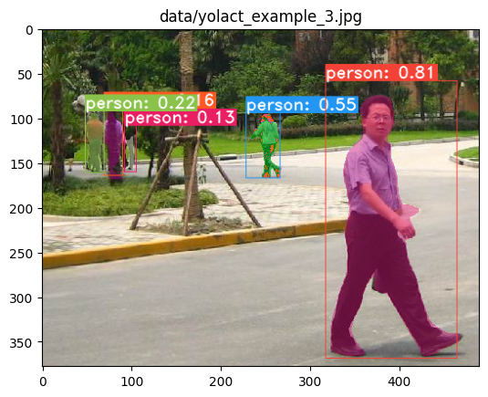

**ONNX and OpenVINO Compatible Yolact Model**

- The yolact model is a simple, fully convolutional model for real-time instance segmentation

- YOLACT is an acronym for "You Only Look At CoefficienTs," which reflects the core philosophy behind this state-of-the-art real-time instance segmentation model
- It leverages the openvino and onnx frameworks for inference.
- Currently, only the image inference functionality is operational.
- After the conversion process, refactoring the remaining parts becomes easier.

**Installation and Issue Resolution**

- To explore the original model or download the pretrained weights visit the [Yolact GitHub Repo](https://github.com/dbolya/yolact).
- For OpenVino installation issues and further details, please refer to the [OpenVino GitHub Repo](https://github.com/openvinotoolkit/openvino_notebooks).

---
# **Y**ou **O**nly **L**ook **A**t **C**oefficien**T**s
```
    ██╗   ██╗ ██████╗ ██╗      █████╗  ██████╗████████╗
    ╚██╗ ██╔╝██╔═══██╗██║     ██╔══██╗██╔════╝╚══██╔══╝
     ╚████╔╝ ██║   ██║██║     ███████║██║        ██║   
      ╚██╔╝  ██║   ██║██║     ██╔══██║██║        ██║   
       ██║   ╚██████╔╝███████╗██║  ██║╚██████╗   ██║   
       ╚═╝    ╚═════╝ ╚══════╝╚═╝  ╚═╝ ╚═════╝   ╚═╝ 
```



# Installation
 - Clone this repository and enter it:
   ```Shell
   git clone https://github.com/Abdullah-Elkasaby/238-yolact-image-segmentation
   cd 238-yolact-image-segmentation
   ```
 - Set up the environment using one of the following methods:
   - Using [Anaconda](https://www.anaconda.com/distribution/)
     - Run `conda env create -f environment.yml`
   - Manually with pip
     - Set up a Python3 environment (e.g., using virtenv).
     - Install [Pytorch](http://pytorch.org/) 1.0.1 (or higher) and TorchVision.
     - Install some other packages:
       ```Shell
       # Cython needs to be installed before pycocotools
       pip install cython
       pip install opencv-python pillow pycocotools matplotlib 
       ```


